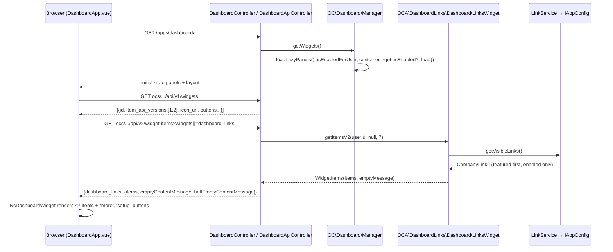

### Overview

`dashboard_links` is a small Marketplace app that sits on top of three official Nextcloud subsystems and one optional neighbour. It registers one Dashboard widget through the app-framework bootstrap (`IBootstrap::register()` → `registerDashboardWidget()`), implemented as an `IAPIWidgetV2` so the server's own Vue 3 dashboard renders the tile from an OCS JSON payload and the app ships no dashboard JavaScript at all. It stores its own catalog of admin-configured links as a lazy array in `IAppConfig`, edited through an admin settings page (`ISettings` + `IIconSection` declared in `info.xml`) backed by a small `OCSController`. It may optionally *import* from the official External sites app (`external`) through that app's admin OCS endpoint, but it never depends on `external` at the PHP level, because `external` exposes no public PHP API, no events, no OCC command and no table — just appconfig JSON, a navigation hook, one iframe page and an OCS route.

Shipping means passing the live App Store XSD (`https://apps.nextcloud.com/schema/apps/info.xsd`, which is wider than the server copy and stricter about `max-version`), holding a store certificate whose CN is the app id, producing two distinct SHA-512 signatures (one over the tarball for the store API, one inside `appinfo/signature.json` for server integrity), and following the `nextcloud/coding-standard` + psalm + REUSE toolchain that every official app in 2026 uses. The reference skeleton to copy is `nextcloud/external` for project shape and `apps/user_status/lib/Dashboard/UserStatusWidget.php` for the widget class.

### Key Concepts

- **`IBootstrap`** — `OCA\DashboardLinks\AppInfo\Application` implements `register(IRegistrationContext)` (lazy, declarative registrations only) and `boot(IBootContext)`. The legacy `appinfo/app.php` is rejected by current servers.
- **`IWidget` family (`OCP\Dashboard\*`)** — `IWidget` is the base (id, title, order, icon class, url, `load()`). `IAPIWidget::getItems()` serves mobile/desktop clients (API v1). `IAPIWidgetV2::getItemsV2()` returns a `WidgetItems` envelope the *browser* renders generically (API v2, NC 27.1+). `IIconWidget`, `IButtonWidget`, `IOptionWidget`, `IReloadableWidget` (needs V2), `IConditionalWidget` are opt-ins.
- **`WidgetItem` / `WidgetItems` / `WidgetButton`** — the tile's data model. `WidgetItem(title, subtitle, link, iconUrl, sinceId, overlayIconUrl = '')`. `WidgetItems(items, emptyContentMessage = '', halfEmptyContentMessage = '')`. `WidgetButton(type, link, text)` with `TYPE_NEW|TYPE_MORE|TYPE_SETUP`.
- **`OC\Dashboard\Manager`** — private server class that instantiates registered widget classes per request, filters them by `IAppManager::isEnabledForUser()` and `IConditionalWidget`, and rejects duplicate ids.
- **Layout** — the per-user ordered list of widget ids in `IUserConfig` (`dashboard`/`layout`), falling back to the `dashboard` appconfig `layout` key, then to the hard-coded `recommendations,spreed,mail,calendar`. Enabling an app does not touch it.
- **`IAppConfig`** — typed key/value store per app (`oc_appconfig`). `OCP\IAppConfig` takes an `$app` argument; `OCP\AppFramework\Services\IAppConfig` is the app-scoped sibling. Types are sticky after the first write; `lazy: true` keeps big blobs out of the always-loaded config cache.
- **`ISettings` / `IIconSection`** — admin settings form and its section, declared in `info.xml` `<settings>`, not in `IBootstrap`.
- **`external` public surface** — capability `external.v1 = [sites, device, groups, redirect]`, `GET /ocs/v2.php/apps/external/api/v1` (user-filtered), `GET/POST/PUT/DELETE /ocs/v2.php/apps/external/api/v1/sites` (admin), and the web route `external.site.showPage` (`/apps/external/{id}/`). Everything under `OCA\External\*` and the appconfig key `external/sites` is private.
- **Store XSD vs server XSD** — two schemas for `info.xml`. The official `lint-info-xml.yml` template validates against the store one. Use it.
- **Two signatures** — `openssl dgst -sha512 -sign` over `dashboard_links.tar.gz` (upload signature, store API) and `occ integrity:sign-app` → `appinfo/signature.json` (server integrity check). Both use the same private key.

### How It Works

**1. Boot and widget registration.** On every request the `Coordinator` (`lib/private/AppFramework/Bootstrap/Coordinator.php`) calls `Application::register()` for each enabled app, then `RegistrationContext::delegateDashboardPanelRegistrations()`, which forwards to `IManager::lazyRegisterWidget($class, $appId)` on `OC\Dashboard\Manager`. Nothing is instantiated yet. Our `Application::register()` therefore does exactly two things: `$context->registerDashboardWidget(LinksWidget::class)` and, optionally, `$context->registerCapability(Capabilities::class)`. It must not query `IAppManager` or config here; the docs and the coordinator's design both require `register()` to stay lazy. The dashboard explorer confirmed three things that stale material contradicts: `info.xml`'s `<dashboard><widget>` element is still in the XSD but `AppManager::loadApp()` no longer applies it (it does still apply `<settings>`, activity and collaboration); `RegisterWidgetEvent` was removed in NC 29; and the old `nextcloud/dashboard` repository's `IDashboardWidget` is pre-NC20 and obsolete. Bootstrap is the only registration path.

Set `<namespace>DashboardLinks</namespace>` in `info.xml`. Without it the server derives `OCA\` + `ucfirst('dashboard_links')` = `OCA\Dashboard_links`, and `lib/AppInfo/Application.php` would have to live in that namespace.

**2. Rendering the dashboard page.** When a user opens `/apps/dashboard/`, `DashboardController::index()` (`apps/dashboard/lib/Controller/DashboardController.php`) calls `IManager::getWidgets()`, which triggers `Manager::loadLazyPanels()`. For each registered class the manager skips it if `IAppManager::isEnabledForUser($appId)` is false (this is how `occ app:enable dashboard_links --groups=staff` becomes a group-visibility lever for the tile), resolves the class from the DI container, skips it if it implements `IConditionalWidget` and `isEnabled()` returns false, throws `InvalidArgumentException` on a duplicate `getId()`, and calls `load()` (logging if it takes over a second). The controller then provides initial state: `panels` (id, title, iconClass, iconUrl, url for *all* surviving widgets) and `layout` from `DashboardService` (`apps/dashboard/lib/Service/DashboardService.php`), which reads the user's `IUserConfig` `dashboard`/`layout`, else the `dashboard` appconfig `layout`, else the four shipped defaults.

The consequence: a freshly enabled `dashboard_links` tile is *not* on anyone's dashboard. It appears in the Customize drawer, and each user must tick it — or an admin sets the instance default with `occ config:app:set dashboard layout --value "recommendations,spreed,mail,calendar,dashboard_links"`, which only affects users who never customised. Writing every user's layout from the app is technically possible and violates the store's "respect user choices" guideline; the parent brief rules it out.

**3. Fetching the items.** `apps/dashboard/src/main.js` mounts `DashboardApp.vue` with Vue 3 (`createApp`; the developer manual's `Vue.extend` snippet is stale). `fetchApiWidgets()` calls `GET /ocs/v2.php/apps/dashboard/api/v1/widgets`, whose per-widget record includes `item_api_versions`, `icon_url`, `item_icons_round`, `reload_interval` and `buttons`. For every widget in the user's layout whose `item_api_versions` contains `2`, the frontend calls `GET /ocs/v2.php/apps/dashboard/api/v2/widget-items?widgets[]=dashboard_links` **without a `limit` parameter**, so `DashboardApiController::getWidgetItemsV2()` invokes `LinksWidget::getItemsV2($userId, null, 7)`. `ApiDashboardWidget.vue` then renders the result through `@nextcloud/vue`'s `NcDashboardWidget`. Because we are API v2, `DashboardApp.vue` never calls `OCA.Dashboard.register` for us, and `load()` must stay empty — adding a script there fights the generic renderer.



**4. The widget class.** Copy `apps/user_status/lib/Dashboard/UserStatusWidget.php`: implement `IAPIWidget`, `IAPIWidgetV2`, `IIconWidget`, `IButtonWidget`, inject `IL10N`, `IURLGenerator`, `IGroupManager` and the app's `LinkService` via promoted constructor parameters. `getId()` returns `dashboard_links` (matches the widget-id pattern `[a-z][a-z0-9\-_]*`; the app-id prefix guarantees global uniqueness). `getOrder()` returns 20 — docs reserve 0–9 for shipped widgets even though `FavoriteWidget` returns 0 and `UserStatusWidget` 5; the community `externalportal` uses 0 and that is the one thing not to copy from it. `getIconClass()` returns a monochrome CSS class and `getIconUrl()` an absolute URL from `IURLGenerator::getAbsoluteURL($urlGenerator->imagePath('dashboard_links', 'app-dark.svg'))`; the dashboard inverts icons for dark mode, so avoid `var(--icon-*)` colours. `getUrl()` points at the app's own full-list page (header click). `getItems()` and `getItemsV2()` share one private mapper: `CompanyLink` → `WidgetItem(title, subtitle, link, iconUrl, (string) $id)`. Honour `$limit`; for `$since`, return the items after the link with that id in the sorted order — cheap, and clients may page with it. `getItemsV2()` wraps the list in `WidgetItems($items, $this->l10n->t('No links configured yet'))`. `getWidgetButtons(string $userId)` returns `TYPE_MORE` → full-list page when the catalog exceeds seven, and `TYPE_SETUP` → the admin settings URL only when `IGroupManager::isAdmin($userId)`. `TYPE_NEW` is not rendered on the web (`ApiDashboardWidget.vue` has a TODO), so skip it. `IReloadableWidget` requires V2 and a static list gains nothing from polling; omit it. `IOptionWidget` defaults to square item icons, which suits company logos; omit unless you want round.

**5. Storing the catalog.** The domain is fixed by the parent brief: `CompanyLink {id, title, href, importance featured|normal|reference, openMode iframe|redirect, iconUrl?, enabled, sort}`. Store the whole catalog as one array under a single key with `OCP\IAppConfig::setValueArray('dashboard_links', 'links', $links, lazy: true)` plus an integer `max_id` counter (mirroring `external`'s never-reused `max_site`). Read with `getValueArray(..., lazy: true)` — passing `lazy: false` on a lazy key silently returns the default. Two decisions are irreversible in practice: the type of a key is locked by its first setter (NC 29+), and `external` chose a JSON *string* while new code should choose *array*; pick array once and keep it. The optional config lexicon (`registerConfigLexicon()` on the registration context) declares key types, lazy flags and defaults up front so the lazy/type mistakes cannot happen; the marketplace explorer saw it in the docs but did not pin its `@since` — check before relying on it for the NC 33 floor. A `LinkService` owns validation: non-empty title, `FILTER_VALIDATE_URL` and an `https` scheme (the brief says "https after parse"; `external` accepts `http`, `https`, `mailto`), enum checks on `importance` and `openMode`. Sorting is `importance` rank then `sort`; the tile shows the first seven, so featured links are what most users ever see. No migration or table is needed; if you later want a table, `lib/Migration/Version*.php` + `SimpleMigrationStep` is the path (`database.xml` is legacy). Add an uninstall repair step (`<repair-steps><uninstall>`) that calls `IAppConfig::deleteApp('dashboard_links')` — the store guideline asks for a clean uninstall.

**6. Admin editing.** Settings registration stays in `info.xml`: `<settings><admin>OCA\DashboardLinks\Settings\Admin</admin><admin-section>OCA\DashboardLinks\Settings\Section</admin-section></settings>`. `Section` implements `IIconSection` (`getID()` = `dashboard_links`, `getName()`, `getPriority()`, `getIcon()`); a links editor is large enough for its own section rather than piggybacking on `additional`. `Admin::getForm()` does what `OCA\External\Settings\Admin` does: `Util::addScript('dashboard_links', 'dashboard_links-admin')`, `Util::addStyle(...)`, and returns a `TemplateResponse` whose template is a single mount `<div id="dashboard_links-admin">`. The Vite bundle name is `{appId}-{entry}`, so a `createAppConfig({ admin: 'src/admin.ts' })` entry in `vite.config.ts` yields exactly that script name. `src/admin.ts` does `createApp(AdminSettings).mount(...)` with Vue 3.5 and `@nextcloud/vue` 9 components (import path `@nextcloud/vue/components/NcButton`). `external`'s admin fetches on mount rather than using initial state; either is fine, and if you do want initial state use `OCP\AppFramework\Services\IInitialState`, not the deprecated `IInitialStateService` the dashboard docs still show.

Writes go through `OCA\DashboardLinks\Controller\APIController extends OCSController` at `/ocs/v2.php/apps/dashboard_links/api/v1/links` (GET list, POST, PUT `{id}`, DELETE `{id}`), routed via `appinfo/routes.php` or `#[ApiRoute]` attributes. Admin-only means *no* `#[NoAdminRequired]`. Keep CSRF on for every mutating method — `@nextcloud/axios` sends `requesttoken` automatically — and use `#[NoCSRFRequired]` only on a GET that clients need. `#[PasswordConfirmationRequired]` is a reasonable addition for destructive edits. If group admins should edit links, swap `ISettings` for `IDelegatedSettings` (`getAuthorizedAppConfig()`) and tag the controller methods with `#[AuthorizedAdminSetting(settings: Admin::class)]`. Declarative settings (NC 29+) exist but only model flat fields, not a CRUD list.

**7. Open modes and the iframe problem.** The Dashboard page's `TemplateResponse` carries the default CSP (`frame-src 'self'`); `external` relaxes `frame-src` to `*` only on its own `SiteController::createResponse()` frame page. So a tile can never embed a site; a `WidgetItem::link` is a navigation. `redirect` links are the raw external URL. `iframe` links point at an in-Nextcloud page that embeds the site: either our own `PageController::open(int $id)` returning `templates/frame.php` with `ContentSecurityPolicy::addAllowedFrameDomain('*')` (a direct copy of `SiteController`), or — when the link was imported from `external` and `IAppManager::isEnabledForUser('external')` holds — `IURLGenerator::linkToRouteAbsolute('external.site.showPage', ['id' => $externalId])`. The second option reuses `external`'s JWT and placeholder substitution but couples our record to `external`'s site id; the first is self-contained. Either way the CSP relaxation is one-sided: the remote site's `X-Frame-Options`/`frame-ancestors` and browser mixed-content rules still win, which is why the admin manual recommends redirect for most sites. Note that in `external`, `redirect` is only a nav-href/`_blank` choice; `SiteController` iframes any id you open directly, so do not model `openMode` on that controller's behaviour.

**8. Optional reuse of `external`.** `external` 10.0.0 targets NC 35 only, is maintained on a critical-bugs-only basis, has no dashboard widget, emits no events, and the community `externalportal` already wraps its user OCS into a tile. `info.xml` has no element for depending on another app; the only mechanism is the runtime check `IAppManager::isEnabledForUser('external')` (or the `external.v1` capability, from a client). The correct reuse shape for `dashboard_links` is therefore a one-time **import**, executed in the admin Vue: the admin's browser calls `GET /ocs/v2.php/apps/external/api/v1/sites` (the admin route, which returns the full record including `groups`, `lang`, `device`, `redirect` that the user route strips), the UI maps `name→title`, `url→href`, `redirect→openMode`, `icon→iconUrl`, and posts the result to our own OCS. That avoids a server-side loopback HTTP call with someone's credentials and avoids reading `IAppConfig('external', 'sites')`, which is unfiltered (all groups), has a write-on-read migration side effect in `SitesManager::getSites()`, and is a private schema. Never `use OCA\External\SitesManager`; the store rule is public OCP API only, and the class has changed across 5.x–10.x. Never write to `external`'s keys.

**9. Shipping to the Marketplace.** `info.xml` must satisfy the *store* XSD: `id`, `name`, `summary`, `description`, semver `version`, `licence`, `author`, `category`, `bugs`, and `<dependencies><nextcloud min-version max-version/></dependencies>` — `max-version` is required by the live XSD even though prose docs treat it as optional. Where docs, server XSD and store XSD disagree, the store XSD and `lint-info-xml.yml` (which wgets it) win: category `dashboard` exists there (and in the current server XSD; the developer-manual list is stale); licence is `AGPL-3.0-or-later` in SPDX form, which both schemas accept, whereas the `agpl` shorthand `external` still ships is deprecated for NC 31+. Deprecated nodes `default_enable`, `shipped`, `standalone`, `public`, `remote`, `requiremin/max` fail store validation — do not copy `recommendations`' `<default_enable/>`. The name must not contain "Nextcloud". A defensible first release looks like:

```xml
<info xmlns:xsi="http://www.w3.org/2001/XMLSchema-instance"
      xsi:noNamespaceSchemaLocation="https://apps.nextcloud.com/schema/apps/info.xsd">
  <id>dashboard_links</id>
  <name>Company Links Dashboard</name>
  <summary>Dashboard tile with admin-configured company links</summary>
  <description>…</description>
  <version>1.0.0</version>
  <licence>AGPL-3.0-or-later</licence>
  <author mail="…">…</author>
  <namespace>DashboardLinks</namespace>
  <category>dashboard</category>
  <bugs>https://github.com/…/issues</bugs>
  <dependencies>
    <php min-version="8.2" max-version="8.5"/>
    <nextcloud min-version="33" max-version="35"/>
  </dependencies>
  <settings>
    <admin>OCA\DashboardLinks\Settings\Admin</admin>
    <admin-section>OCA\DashboardLinks\Settings\Section</admin-section>
  </settings>
</info>
```

Versions as of today: NC 33 (33.0.9) and 34 (34.0.4) are supported, 32 is EOL, 35.0.0 is scheduled for release today. PHP is 8.2–8.5 on 33/34 and 8.3–8.5 on 35, so a 33–35 app declares `php min-version="8.2"`. The store's "latest + 1" rule allows `max-version="36"` once 35 is out; `35` is the conservative choice until then. Dropping a still-supported NC or PHP later is a semver major.

Identity and signing are a one-time human step: `openssl req -nodes -newkey rsa:4096 -keyout dashboard_links.key -out dashboard_links.csr -subj "/CN=dashboard_links"`, PR the CSR to `nextcloud/app-certificate-requests`, keep `~/.nextcloud/certificates/dashboard_links.{key,crt}` private, register the app at `apps.nextcloud.com/developer/apps/new` (signature = SHA-512 over the literal id string). Re-registering a new certificate deletes every release. Per release: bump `<version>`, update `CHANGELOG.md` with headers matching `^## (?:\[)?(?:v)?(\d+\.\d+(\.\d+)?)` (Keep a Changelog; `## [Unreleased]` for prereleases), add `CHANGELOG.en.md` if you want users to see update notes (NC 29+), then `npm ci && npm run build && composer install --no-dev`, strip `src/`, `tests/`, `vendor-bin/`, `node_modules/` via `.nextcloudignore`/krankerl, run `occ integrity:sign-app --privateKey … --certificate … --path …` to write `appinfo/signature.json`, pack a tarball whose single top-level folder is `dashboard_links/`, attach `dashboard_links.tar.gz` to a GitHub Release (GitHub's auto source archive fails because its folder is `repo-1.0.0/`), sign the archive with `openssl dgst -sha512 -sign dashboard_links.key dashboard_links.tar.gz | openssl base64`, and `POST /api/v1/apps/releases {download, signature}` with the account token. The store downloads, verifies, XSLT-normalises and validates, then discards the file — the GitHub URL must stay live. Do not flag semver prereleases (`-rc.1`) as `nightly`; nightlies only reach `daily`/`git` channels. The official `appstore-build-publish.yml` template encodes all of this but is gated on `github.repository_owner == 'nextcloud-releases'`; copy its steps and drop the `if`. Once an app has been signed, unsigned updates are refused. Instances then pick the release up through the Apps page or `occ app:update dashboard_links`, honouring `min/max-version`; PHP/DB constraints are checked at install only.

**10. Coding conventions.** PHP: `declare(strict_types=1)`, tabs (width 4), 80-column target, K&R braces, single quotes, constructor promotion with `private readonly`, `#[\Override]`, SPDX header (`SPDX-FileCopyrightText` + `SPDX-License-Identifier: AGPL-3.0-or-later`) on every file, `REUSE.toml` for lockfiles and assets, `.editorconfig` (utf-8, LF, tabs; 2-space for YAML and `package.json`). Tooling via `bamarni/composer-bin-plugin`: `vendor-bin/csfixer` with `friendsofphp/php-cs-fixer` + `nextcloud/coding-standard ^1.5`, `vendor-bin/psalm` with `vimeo/psalm ^6.16`, `vendor-bin/phpunit` with `phpunit/phpunit ^10.5`; `nextcloud/ocp` in `require-dev` (the `update-nextcloud-ocp.yml` template keeps it current); zero production Composer dependencies. Frontend: Vue 3.5, `@nextcloud/vue` 9, Vite 7 through `@nextcloud/vite-config` 2, `@nextcloud/eslint-config` 9, node 24/npm 11, `"type": "module"`. Official small apps have no Jest/Vitest; PHP unit tests live in `tests/Unit` (the `recommendations` layout) and extend `PHPUnit\Framework\TestCase` with mocked `OCP\*` interfaces — `\Test\TestCase` requires a server checkout and is a CI-only luxury. Translations: `IL10N::t()` in PHP, `t('dashboard_links', …)` from `@nextcloud/l10n` in JS, `.tx/config`, committed `l10n/*.js|json`, `.l10nignore` for `js/` and `vendor/`.

### Where Things Live

```
dashboard_links/                      # folder name == <id> == cert CN == tarball root
├── appinfo/
│   ├── info.xml                      # store XSD; <namespace>DashboardLinks</namespace>; <settings>; repair-steps/uninstall
│   ├── routes.php                    # OCS api/v1/links CRUD + page/open routes   (external: appinfo/routes.php)
│   └── signature.json                # generated by occ integrity:sign-app at release time
├── lib/
│   ├── AppInfo/Application.php       # IBootstrap: registerDashboardWidget, registerCapability   (external + user_status)
│   ├── Dashboard/LinksWidget.php     # IAPIWidget + IAPIWidgetV2 + IIconWidget + IButtonWidget, empty load()   (user_status UserStatusWidget)
│   ├── Service/LinkService.php       # IAppConfig array (lazy) + max_id, validation, sorting   (external SitesManager, minus filters)
│   ├── Model/CompanyLink.php         # value object; jsonSerialize for OCS
│   ├── Controller/APIController.php  # OCSController, admin-only, CSRF on   (external APIController)
│   ├── Controller/PageController.php # full-list page (TYPE_MORE / getUrl) + iframe page with relaxed CSP   (external SiteController)
│   ├── Settings/Admin.php            # ISettings::getForm → Util::addScript + TemplateResponse   (external Settings/Admin)
│   ├── Settings/Section.php          # IIconSection   (external Settings/Section)
│   ├── Capabilities.php              # optional ICapability dashboard_links.v1
│   └── Migration/Uninstall.php       # IRepairStep: IAppConfig::deleteApp
├── templates/
│   ├── settings.php                  # <div id="dashboard_links-admin">   (external templates/settings.php)
│   ├── links.php                     # all-links page
│   └── frame.php                     # <iframe> shell   (external templates/frame.php)
├── src/
│   ├── admin.ts                      # createApp(AdminSettings)   (external src/admin.ts)
│   ├── AdminSettings.vue             # list editor + "Import from External sites" button
│   ├── services/api.ts               # @nextcloud/axios + generateOcsUrl   (external src/services/api.ts)
│   └── types.ts
├── js/                               # Vite output dashboard_links-admin.mjs (gitignored for a store app)
├── img/app.svg, img/app-dark.svg     # widget/nav icons; served same-origin
├── l10n/                             # Transifex output
├── tests/bootstrap.php, tests/Unit/  # phpunit 10   (recommendations tests/Unit + phpunit.xml.dist)
├── composer.json                     # zero prod deps; bamarni plugin; nextcloud/ocp dev
├── vendor-bin/{csfixer,phpunit,psalm}/composer.json
├── package.json, vite.config.ts, eslint.config.js, tsconfig.json
├── .php-cs-fixer.dist.php, psalm.xml, .editorconfig, .l10nignore, .tx/config
├── REUSE.toml, LICENSES/AGPL-3.0-or-later.txt
├── CHANGELOG.md, CHANGELOG.en.md
├── krankerl.toml, .nextcloudignore
└── .github/workflows/                # lint-info-xml, lint-php, lint-php-cs, psalm, phpunit-*, node, reuse,
                                      # appstore-build-publish (org template minus the nextcloud-releases gate)
```

There is deliberately no `src/dashboard.*`: the V2 contract means the server's own Vue renders the tile.

### Gotchas

1. **Enabling ≠ visible.** The tile only shows for users who tick it in Customize or whose layout inherits the admin default set with `occ config:app:set dashboard layout`. Group-restricting the app (`app:enable --groups`) hides the tile from other groups because `Manager::loadLazyPanels()` checks `isEnabledForUser()`.
2. **Seven items, hard.** The web frontend never sends `limit`; `getItemsV2()` receives 7. The `TYPE_MORE` button is the overflow path, and it needs somewhere to point — hence `PageController::index()` and `templates/links.php`. `since`/`limit` up to 30 only matter for clients.
3. **`getOrder()` 0–9 is docs-reserved, not enforced.** Shipped widgets use 0–5 and `externalportal` uses 0; use 20 anyway.
4. **`WidgetItems` getter docblocks are swapped in server source.** Trust the constructor order `(items, emptyContentMessage, halfEmptyContentMessage)` and `jsonSerialize()`.
5. **Item icons must be same-origin (not verified by the explorers).** The Dashboard page's CSP is owned by the `dashboard` app and the server default `img-src` is `'self' data: blob:`, so a favicon hosted on `https://intranet.example.com` will be blocked. Serve icons from `img/` or from an `IAppData` folder via your own controller (the `external` `IconController` pattern). Confirm against `lib/public/AppFramework/Http/ContentSecurityPolicy.php` before designing `iconUrl` as a free-text URL.
6. **No control over `_blank` in V2.** Whether `NcDashboardWidgetItem` opens `link` in a new tab could not be confirmed from the truncated template. If redirect-mode links must open in a new tab and the component does not do it, the only lever is a custom dashboard bundle (`OCA.Dashboard.register` + Vue 3 `createApp`), which abandons the zero-JS design.
7. **PHP 8.2 floor vs 8.3 syntax.** The brief's "php min 8.2" for NC 33–35 collides with the copied style: typed class constants (`public const string APP_ID`) are PHP 8.3 and will not parse on 8.2. `#[\Override]` is harmless on 8.2 (unknown attributes are ignored unless reflected) but unenforced. Either drop typed constants or ship NC 35-only with `min-version="8.3"`, like `external` does with one major per release.
8. **`IAppConfig` traps.** Type is locked on first write; lazy keys return defaults when read non-lazily; `OCP\IAppConfig` takes `$app` while `OCP\AppFramework\Services\IAppConfig` is app-scoped. Decide array-vs-string and lazy once; a lexicon makes the decision declarative, but verify its `@since` covers NC 33.
9. **`register()` must stay lazy.** `isEnabledForUser('external')` belongs in the widget or in `boot()`, never in `register()`.
10. **`external` is import-only, not a live dependency.** No PHP API, no events for site changes, admin-only full records, one major per release (10.x = NC 35). Imported iframe links that point at `external.site.showPage` break if `external` is disabled or the site is deleted; store the external id but always fall back to your own frame page or redirect.
11. **Two XSDs, two signatures.** Lint against the store XSD; `max-version` is mandatory there. Sign `signature.json` *after* stripping dev files, then sign the tarball separately. GitHub's auto source zip is the wrong artifact.
12. **CHANGELOG regex.** A header that does not match the store's pattern yields an empty changelog silently. Marking an `-rc` as nightly hides it from stable/beta channels.
13. **Settings registration is `info.xml`, widgets are bootstrap.** Mixing them is the most common first-app mistake; docs also advise bumping the app version when adding settings classes.

Open questions the explorers left unresolved: whether 35.0.0 is actually published today (determines `max-version` 35 vs 36); whether `DashboardApiController` clamps `limit` at 30 at runtime or only in psalm types; whether the store *enforces* "latest + 1" or only reviews it; whether NC 35 still validates `info.xml` against the narrower server XSD on enable (irrelevant if you use `AGPL-3.0-or-later` and `dashboard`, which both schemas accept); the exact current `occ integrity:sign-app` flags; and whether any server path other than `AppManager::loadApp()` still reads `<dashboard>` from `info.xml` (not seen, not exhaustively grepped).